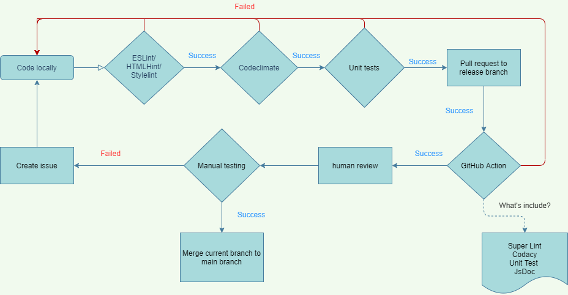

# ASAP CI/CD Pipeline Phase 1

## Pipeline Steps

### Super Lint checks

Our Super Lint includes three types languages checking:

1. HTMLHint: check problems in our HTML file.
2. StyleLint which will check our CSS code.
3. ESLint is for JavaScript

### Code Quality via Codacy
We set up the code quality check, including checking code security and checking whether the code is error prone, by using Codacy.  
It is set up on the Github actions, so basically it will run after each push to the repository and see the results in [codacy](https://app.codacy.com/gh/cse110-fa21-group7/cse110-fa21-group7/dashboard).   
Based on the report in Codacy, we have improved our code grade from C to A and keep the duplication of the code around 10%.

### Automated Jest unit tests

- simple tests to check whether CI/CD pipeline is correctly set up
- unit tests for individual components
- E2E tests for interactions among individual components

### Generate JSDocs

### Human Review

- via pull request
- check and resolve conflicts

## Pipeline Diagram

