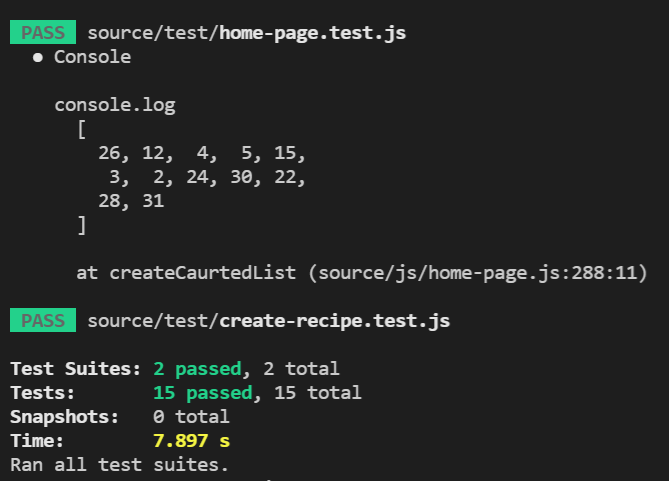
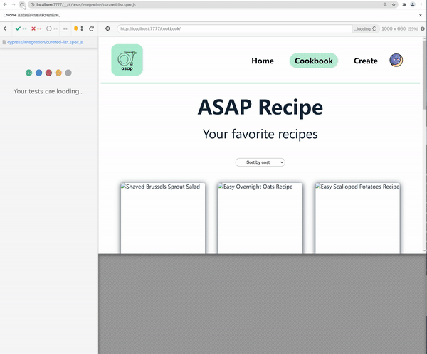
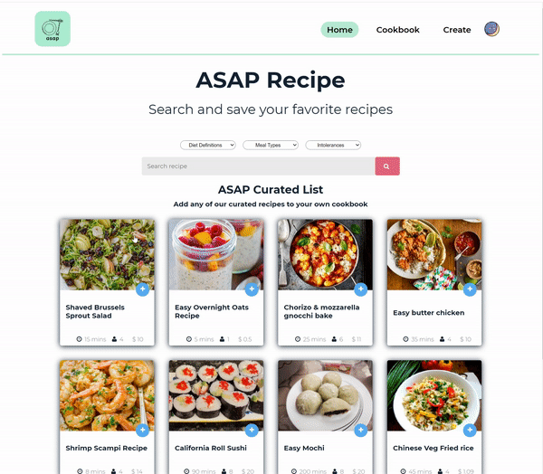
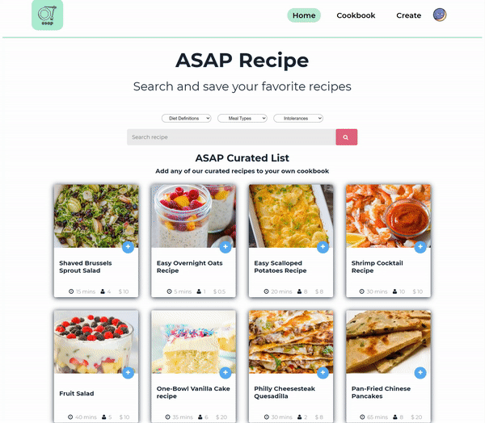
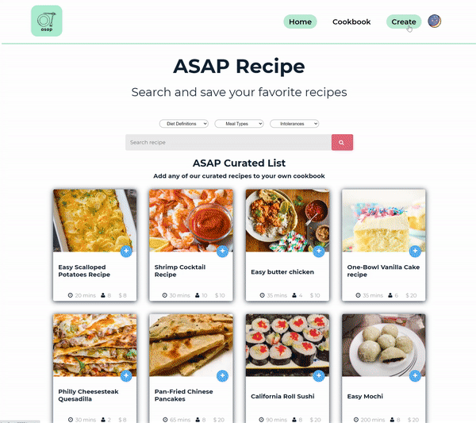
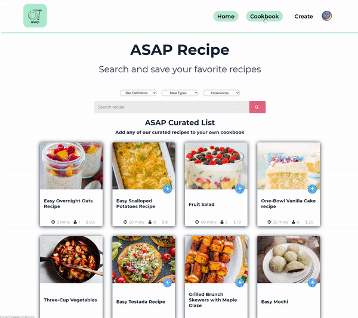
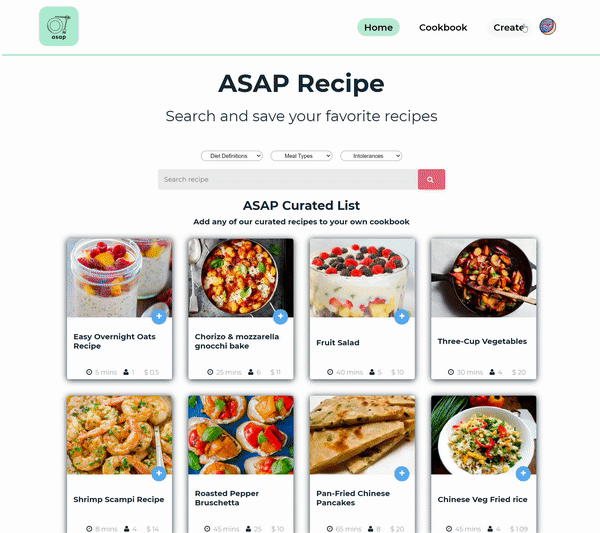
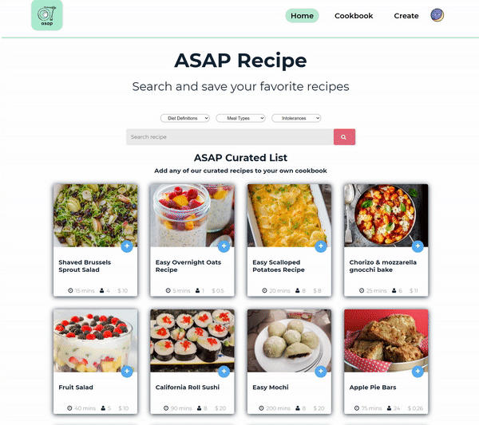

# Onboarding Document:

Follow these steps to set up a local copy of this repo:

## Setup

1. Clone this repo to your local machine https://github.com/cse110-fa21-group7/cse110-fa21-group7.git
2. install Node.js and npm
3. In your local run ` npm install`run to install the dev dependencies
4. create .env file in your root directory. Then go to https://spoonacular.com/ to register a API key for yourself.
5. Copy these 2 lines to you .evn file.
`API_RECIPE_VALUE = "YOUR spoonacular API KEY" 
API_IMGUR_KEY = "1b99956c57a5642"` 
6. Do not forget to replace the API_RECIPE_VALUE to your spoonacular API key.
8. Use `npm run dev` to start the server of our app and check it out via http://localhost:7777.
9. Now you can start coding.

## Where should I put my code?

- If you want to change our APP UI, add your code to [html](source/html) or [css](source/css).
- If you want to add more features to our APP, add your code to [backend code](source/js)
- If you want to write some unit tests or e2e tests to test our code, you can write your code in these directories [e2e](cypress/integration/) and[unit-tests](source/test)

## How to test my code?

- unit tests: you can use this command: `npm run test`. The result should looks like this: 
- For e2e tests, you can use `npx cypress run`. The result should looks like this:
- Or you can use `npx cypress open` this is more powerful UI testing tool create by cypress. You can test any files you wrote. In this example I will test the curated-list.spec.js. The output should like this:

## How to use our APP

### Add recipes from curated list to your cookbook

### Search some recipes

### create your recipe

### update and delete your recipe

### Dark mode

### Random curated list & sort your recipes

